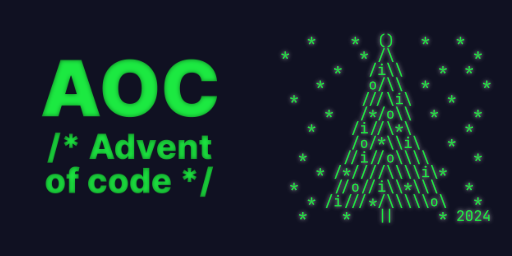

<div align="center">
  <h3>Advent of Code 2024</h3>
  
</div>

## 🎄 What is Advent of Code?

Advent of Code is an annual programming challenge created by Eric Wastl. Each
December, from December 1st to December 25th, a new **programming puzzle** is
released **daily**. These challenges are designed to help programmers improve
their skills, explore new programming concepts, and have fun while coding.

## 🚀 Purpose of this Repository

This repository is part of a structured learning experience to:
- Enhance programming problem-solving skills
- Practice algorithmic thinking
- Explore different approaches to solving computational challenges
- Build a portfolio of programming projects
- Learn a new programming language (Rust)

## 📋 Repository Structure
```
aoc/
│
├── src/
│   ├── day01/
│   ├── day02/
│   └── ...
│
├── README.md
└── .gitignore
```

## 🌟 My Advent of Code Profile

### Personal Information

- **Programming Language**: Rust
- **Year**: 2024
- **Total Stars Collected**: 2

## 🔗 Useful Resources

- [Official Advent of Code Website](https://adventofcode.com/)
- [Advent of Code Reddit Community](https://www.reddit.com/r/adventofcode/)

## 🏆 Tracking Progress (TODO)

Use the checklist below to track your daily challenges:

<details>
<summary>My progress so far...</summary>

- [x] Day 1
- [ ] Day 2
- [ ] Day 3
- [ ] Day 4
- [ ] Day 5
- [ ] Day 6
- [ ] Day 7
- [ ] Day 8
- [ ] Day 9
- [ ] Day 10
- [ ] Day 11
- [ ] Day 12
- [ ] Day 13
- [ ] Day 14
- [ ] Day 15
- [ ] Day 16
- [ ] Day 17
- [ ] Day 18
- [ ] Day 19
- [ ] Day 20
- [ ] Day 21
- [ ] Day 22
- [ ] Day 23
- [ ] Day 24
- [ ] Day 25

</details>

---

**Happy Coding! 🖥️🎄**
